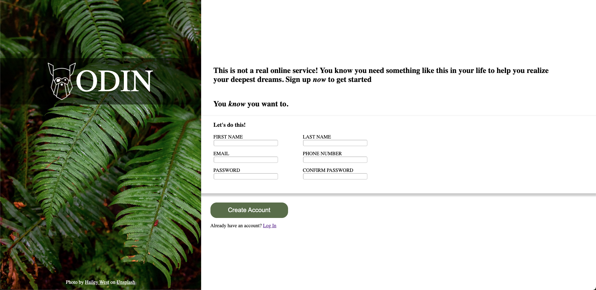

# SignUpForm

The goal of this project was to replicate a sign-up form page. I was given an image of a page and had to replicate it as closely as possible. This project allowed me to practice creating a basic with different types of inputs.

Image of my page: 
